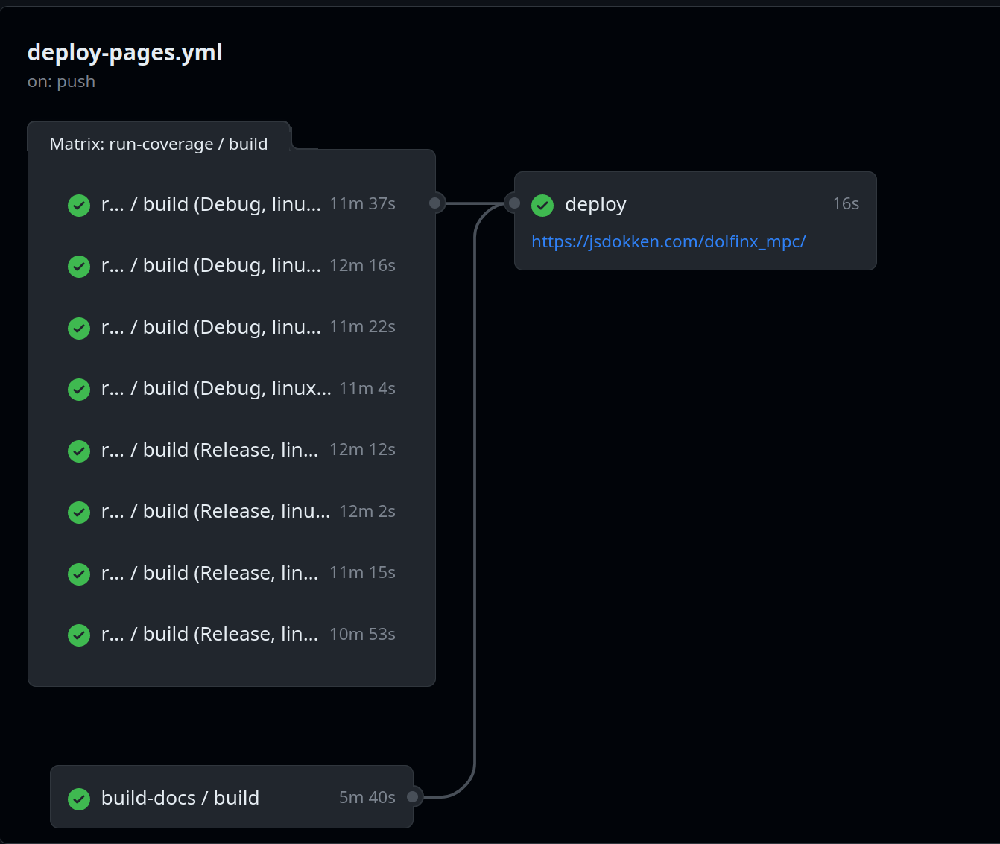
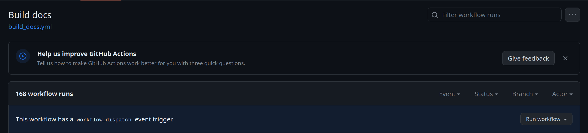
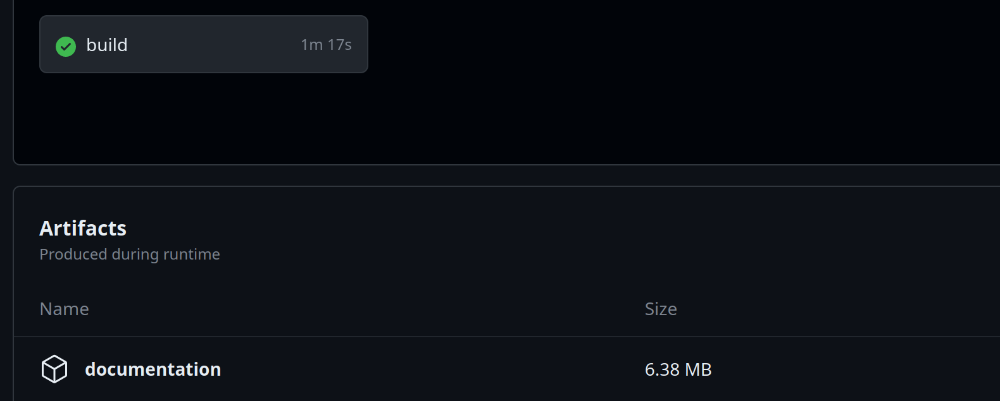

<!-- As your research evolves from ideas into code, you would like to ensure that the code can be used by others.
To ensure quality, consistency and reproducibility of your research, -->

# Continuous Integration
<center>

<a href="https://www.reddit.com/r/ProgrammerHumor/comments/70we66/it_works_on_my_machine/"> Reddit - Programmer Humor - Works on my Machine</a>
</center>


---

## How to start?
<div class="columns">
<div>
 <ul>
  <li>Many ways to do CI; use the one you prefer</li>
  <div style="display:contents;" data-marpit-fragment>
  <ul>
  <li>Github Actions</li>
  <li>Azure DevOps</li>
  <li>Circle CI</li>
  <li>Travis</li>
  </ul>
  <li>List of
<a href="https://github.com/ligurio/awesome-ci"> CI services</a>
  </div>

</ul>

* We will use Github Actions
</div>
<div>
 <figure>

  <figcaption> Turing Way - CC-BY 4.0 licence.  DOI:
  <a href="https://doi.org/10.5281/zenodo.3332807"> 10.5281/zenodo.3332807</a>
</ul>
 </figure>
<div>

---

## Create a workflow

* Create folder `.github/workflows`
* Add a `name_of_workflow.yml`

---

## When should the workflow be executed?

name: Build documentation and upload artifact
```yaml
on:
  pull_request:
    branches: main
  push:
    branches:
      - "*"
    tags:
      - "v*"
  schedule:
    - cron: 0 9 * * 1
  workflow_call:
  workflow_dispatch:
```

---

### Run on pull-request
```yaml
on:
  pull_request:
    branches: main
```

<div style="display:contents;" data-marpit-fragment>

**Triggered when**
* A pull request is made against the `main` branch
* Can make a list of branches `[development, main, "v[0-9].[0-9]+.[0-9]+"]`
* [Cheatsheet](https://docs.github.com/en/actions/using-workflows/workflow-syntax-for-github-actions#filter-pattern-cheat-sheet) for patterns
</div>

---
### Run on push
```yaml
on:
  push:
    branches:
      - "*"
    tags:
      - "v*"

```

<div style="display:contents;" data-marpit-fragment>

**Triggered when**
* A push a commited to any branch
* A tag starting with `v` is created
</div>

---

### Run on schedule


```yaml
 schedule:
    - cron: 0 9 * * 1
```

<div style="display:contents;" data-marpit-fragment>

**Triggered when**
- Specific UCT time in POSIX cron syntax
- Easy interpreter at: [Crontab.guru](https://crontab.guru/#0_9_*_*_1)
</div>

---

### Run from another workflow

```yaml
on:
  workflow_call:
```
* Incredibly powerful feature that makes it possible to make chains of workflows

<div style="display:contents;" data-marpit-fragment>

```yaml
jobs:
  build-docs:
    uses: ./.github/workflows/build_docs.yml
  deploy:
    needs: [build-docs, pre-commit]
```
<div/>

---

#### Chained workflow example



Source: [https://github.com/jorgensd/dolfinx_mpc/actions/runs/6932364745](https://github.com/jorgensd/dolfinx_mpc/actions/runs/6932364745)

---

#### Run workflow manually
```yaml
on:
  workflow_dispatch:
```

<div style="display:contents;" data-marpit-fragment>
Run a workflow manually on CI

</div>

---

## Environment variables

```yaml
env:
  PUBLISH_DIR: ./_build/html
  PYTHON_VERSION: "3.10"
```

* Can be accessed as `${PUBLISH_DIR}` or `${{ env.PUBLISH_DIR }}` depending on context

---

## Setting up a set of jobs

```yaml
jobs:
  build:
    runs-on: ubuntu-22.04
    steps:
      - name: Run echo
        run:  echo "HELLO WORLD"
      - name: Multiple commands
        run: |
          echo "HI"
          ls
```

* Github supports [several architectures](https://docs.github.com/en/actions/using-github-hosted-runners/about-github-hosted-runners/about-github-hosted-runners#supported-runners-and-hardware-resources)
  - Ubuntu (20.04, 22.04)
  - Windows (2019, 2022)
  - Mac (macos-11, macos-12)

---

## Complex dependencies? Use containers!

```yaml
jobs:
  build:
    runs-on: ubuntu-22.04
    container: ghcr.io/fenics/dolfinx/dolfinx:nightly
    steps:
      - name: Run echo
        run:  python3 -c "import dolfinx; print(dolfinx.__version__)
```

* Docker containers hosted anywhere

---


## Complex steps to setup your problem? Create an action!

Github marketplace for actions: https://github.com/marketplace?category=&query=&type=actions

```yaml
jobs:
  clone-repo:
    runs-on: ubuntu-22.04
    steps:
      - name: Checkout current repo on current branch
        uses: actions/checkout@v4
      - name: Look at current files
        run: ls

```

---

## Exercise

- Make a branch in your repository
- Create a workflow that runs on Ubuntu 22.04
- Workflow should run:
  - On every commit on main
  - On every pull request to any branch
- List the files in the repository

---


### Actions can take inputs

```yaml
jobs:
  clone-repo:
    runs-on: ubuntu-22.04
    steps:
      - name: Setup python
        uses: actions/setup-python@v4
        with:
          python-version: ${PYTHON_VERSION}
```

---

### You can create your own actions
```yaml
    - name: Install DOLFINx
      uses: ./.github/actions/install-dolfinx
      with:
        dolfinx: main
        ufl: main
        ffcx: main
        basix: main
        petsc_arch: ${PETSC_ARCH}
```

---

### You can use actions across repositories

Example from: [https://github.com/jorgensd/actions](https://github.com/jorgensd/actions/)
```yaml
name: Use a remote action
on:
  push:
    branches: ["dokken/ci"]
jobs:
  test:
    runs-on: ubuntu-latest
    container: ghcr.io/fenics/dolfinx/dolfinx:nightly
    steps:
      - name: "Use remote action"
        uses: jorgensd/actions/install-dolfinx@v0.1.0
```

---

### Upload data

```yaml
      - name: Upload artifact
        uses: actions/upload-artifact@v3
        with:
          path: ${{ env.PUBLISH_DIR }}
          if-no-files-found: error
          name: documentation
```


---

### Download data

```yaml
      - name: Download docs artifact
        uses: actions/download-artifact@v3
        with:
          name: documentation
          path: "./public"

```
